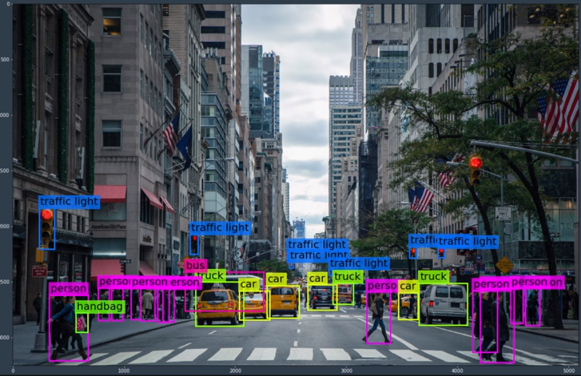
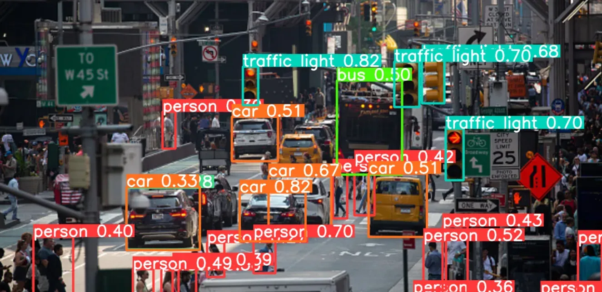

# person_detection

Sistema de **detección** y **seguimiento** de personas en tiempo real, desarrollado en Python con OpenCV y MobileNet‑SSD.

---

## 📸 Capturas


```markdown


```


---

## 🗂 Estructura del proyecto

```bash
person_detection/
├── docs/
│   └── images/
│       ├── deteccion.png       # Pantallazo de detección
│       └── centroides.png       # Pantallazo de tracking
├── models/
│   ├── MobileNetSSD_deploy.prototxt
│   └── MobileNetSSD_deploy.caffemodel
├── centroid_tracker.py         # Implementación del tracker
├── main.py                     # Script principal de detección y control
├── requirements.txt            # Dependencias
├── README.md                   # Este archivo
└── .gitignore                  # Ignora venv/, __pycache__/, etc.
```

---

## ⚙️ Instalación

1. Clona este repositorio:
   ```bash
   git clone https://github.com/tu-usuario/person_detection.git
   cd person_detection
   ```

2. Crea y activa un entorno virtual:
   ```powershell
   # Windows (PowerShell)
   py -3 -m venv venv
   Set-ExecutionPolicy -ExecutionPolicy RemoteSigned -Scope CurrentUser
   .\venv\Scripts\Activate.ps1
   ```
   ```bat
   :: Windows (CMD)
   py -3 -m venv venv
   venv\Scripts\activate.bat
   ```
   ```bash
   # Unix / MacOS
   python3 -m venv venv
   source venv/bin/activate
   ```

3. Instala las dependencias:
   ```bash
   pip install --upgrade pip
   pip install -r requirements.txt
   ```

4. Descarga y coloca los modelos en `models/`:
   - `MobileNetSSD_deploy.prototxt`
   - `MobileNetSSD_deploy.caffemodel`

---

## ▶️ Uso

Con el entorno activo:
```bash
python main.py
```
- Se abrirá la ventana de la cámara.
- Verás rectángulos verdes alrededor de las personas y sus centroides con IDs.
- En consola se imprimirán las coordenadas normalizadas (función `send_control_command`).
- Presiona `q` para salir.

---

## 📋 Detalles del proyecto

- **Lenguaje**: Python 3.x
- **Framework**: OpenCV DNN + MobileNet‑SSD
- **Módulos clave**:
  - `centroid_tracker.py`: lógica de tracking basada en centroides.
  - `main.py`: carga del modelo, detección y control.
- **Dependencias**:
  - opencv-python
  - imutils
  - numpy
  - scipy

---

## 🖥️ Código de Ejemplo

Este es un fragmento del archivo `main.py` que realiza:

- Detección de personas, bicicletas, coches y autobuses con MobileNet-SSD.
- Tracking de centroides.
- Lectura de matrículas de coches y motos con EasyOCR.
- Almacenado de las matrículas en MySQL.

```python
import cv2
import numpy as np
import imutils
import mysql.connector
import easyocr
from centroid_tracker import CentroidTracker

# Conexión a la base de datos MySQL
db = mysql.connector.connect(
    host="TU_HOST",
    user="TU_USUARIO",
    password="TU_PASSWORD",
    database="vigilancia"
)
cursor = db.cursor()

# Carga del modelo MobileNet-SSD
net = cv2.dnn.readNetFromCaffe(
    "models/MobileNetSSD_deploy.prototxt",
    "models/MobileNetSSD_deploy.caffemodel"
)
CLASSES = ["background","aeroplane","bicycle","bird","boat",
           "bottle","bus","car","cat","chair","cow","diningtable",
           "dog","horse","motorbike","person","pottedplant",
           "sheep","sofa","train","tvmonitor"]
TARGET = {"car","motorbike"}

# Inicializa tracker, OCR y cascade de placas
tracker = CentroidTracker()
reader = easyocr.Reader(['en'], gpu=False)
plate_cascade = cv2.CascadeClassifier(
    "models/haarcascade_russian_plate_number.xml"
)

# Captura de video
vs = cv2.VideoCapture(0)

while True:
    ret, frame = vs.read()
    if not ret:
        break
    frame = imutils.resize(frame, width=600)
    (h, w) = frame.shape[:2]

    # Detección DNN
    blob = cv2.dnn.blobFromImage(
        cv2.resize(frame, (300, 300)),
        0.007843, (300, 300), 127.5
    )
    net.setInput(blob)
    detections = net.forward()

    rects, labels = [], []
    for i in range(detections.shape[2]):
        conf = detections[0, 0, i, 2]
        if conf < 0.5:
            continue
        idx = int(detections[0, 0, i, 1])
        label = CLASSES[idx]
        if label not in TARGET:
            continue
        box = (detections[0, 0, i, 3:7] * [w, h, w, h]).astype("int")
        (sx, sy, ex, ey) = box
        rects.append((sx, sy, ex, ey))
        labels.append(label)
        cv2.rectangle(
            frame, (sx, sy), (ex, ey), (0, 0, 255), 2
        )

    # Seguimiento
    objects = tracker.update(rects)

    for ((objectID, centroid), label) in zip(objects.items(), labels):
        cv2.circle(frame, tuple(centroid), 4, (255, 255, 255), -1)
        cv2.putText(
            frame, f"ID {objectID}",
            (centroid[0] - 10, centroid[1] - 10),
            cv2.FONT_HERSHEY_SIMPLEX, 0.5, (255, 255, 255), 2
        )
        if label in TARGET:
            # Lectura de matrícula
            i = list(objects.keys()).index(objectID)
            sx, sy, ex, ey = rects[i]
            roi = frame[sy:ey, sx:ex]
            plates = plate_cascade.detectMultiScale(roi, 1.1, 10)
            for (px, py, pw, ph) in plates:
                plate_img = roi[py:py+ph, px:px+pw]
                texts = reader.readtext(plate_img, detail=0)
                if not texts:
                    continue
                plate = texts[0].replace(" ", "")
                cursor.execute(
                    "INSERT IGNORE INTO plates (object_id, label, plate) VALUES (%s,%s,%s)",
                    (objectID, label, plate)
                )
                db.commit()
                cv2.rectangle(
                    frame,
                    (sx+px, sy+py),
                    (sx+px+pw, sy+py+ph),
                    (0, 165, 255), 2
                )
                cv2.putText(
                    frame, plate,
                    (sx+px, sy+py-10),
                    cv2.FONT_HERSHEY_SIMPLEX, 0.7,
                    (0, 165, 255), 2
                )

    cv2.imshow("Vigilancia", frame)
    if cv2.waitKey(1) & 0xFF == ord('q'):
        break

vs.release()
cv2.destroyAllWindows()
```

## 🤝 Contribuciones

¡Las contribuciones son bienvenidas! Abre un _issue_ o un _pull request_ con tus mejoras.

---

## 📝 Licencia

Este proyecto utiliza la licencia **MIT**. Consulta el archivo `LICENSE` para más detalles.

